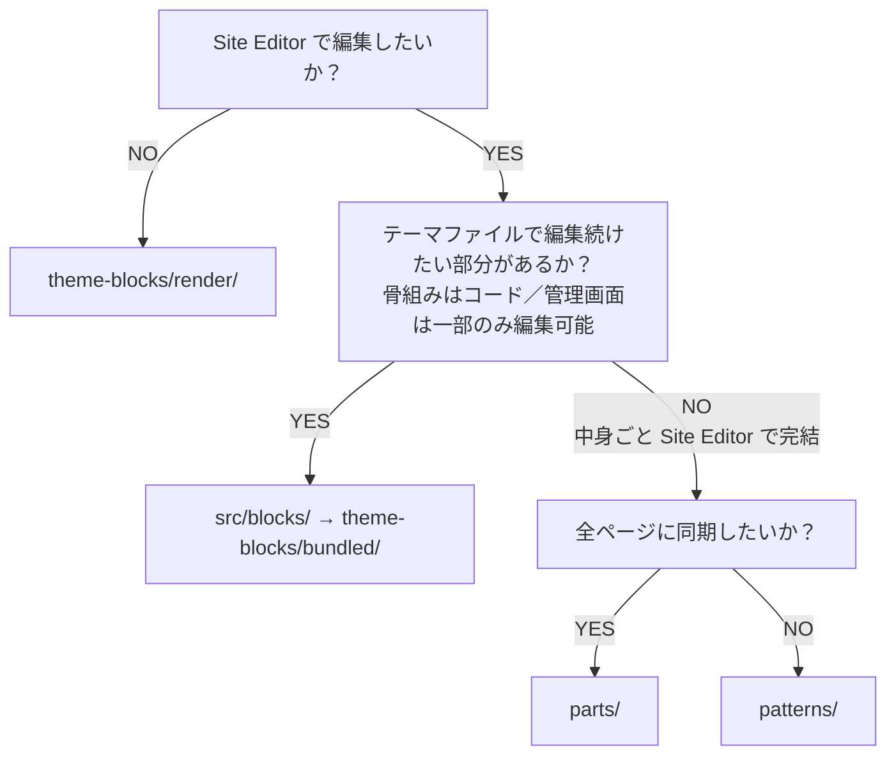

# WordPress Block Theme Starter

ブロックテーマ用テンプレート（配置方針つき）。

クラシックテーマは `wordpress-theme-starter`。
コピー手順の詳細は [SKILL.md](./SKILL.md)。

---

## 1. ディレクトリ構成

```
my-theme/
├── templates/                 # 公式。フラット必須（サブフォルダ不可）
│   ├── index.html             # 必須フォールバック
│   ├── front-page.html
│   ├── home.html
│   ├── page.html
│   ├── single.html
│   ├── single-{cpt}.html      # CPT 用はファイル名で区別
│   ├── archive.html
│   ├── archive-{cpt}.html
│   ├── category.html
│   ├── taxonomy-{tax}.html
│   └── 404.html
├── parts/                     # 公式。フラット必須（サブフォルダ不可）
│   ├── header.html
│   ├── footer.html
│   └── app-cta.html           # 全ページ共通枠の例
├── patterns/                  # WP 6.8+ でサブフォルダ可
│   ├── footer/
│   └── front/
├── theme-blocks/
│   ├── editor.js              # render/ の SSR。ビルドしない。消さない
│   ├── render/                # block.json + render.php。ビルドしない。2層まで可
│   │   └── {group?}/{name}/
│   └── bundled/               # wp-scripts 出力。ここだけ wipe 可
├── src/
│   ├── frontend/              # Vite（サイト全体の JS / SCSS）
│   └── blocks/                # 編集可能な自作ブロックのソース
├── assets/                    # enqueue する CSS / JS / 画像
├── inc/                       # CPT・登録・ユーティリティ（ブロック本体は置かない）
├── theme.json
├── functions.php
├── style.css
├── package.json
└── vite.config.mjs
```

---

## 2. 公式フォルダの制約（フラット必須）

| フォルダ | サブフォルダ | ルール |
|----------|--------------|--------|
| `templates/` | **不可** | 階層はファイル名で表現する |
| `parts/` | **不可** | パーツのスラッグはファイル名そのもの。`/` を含められない |
| `patterns/` | **WP 6.8+ で可** | 機能別に切ってよい（`footer/` `front/` など） |

### 「parts の保存が壊れる」とは

テンプレートパーツの識別子は **ファイル名＝スラッグ**（例: `footer.html` → slug `footer`）です。  
`parts/layout/footer.html` のようにサブフォルダを切ると、パス上は `layout/footer` に見えても、スラッグに `/` を使えません。

その結果:

- テーマファイルとしての発見・登録と、Site Editor が DB に保存するスラッグが食い違う
- 保存後に「どのファイルが正か」が不明になり、リセットや再編集で意図しないパーツが参照される

だから `parts/` はフラット必須です。

### プレフィックス前提で作る

`templates/` と `parts/` はフラットしか使えないので、**種類はファイル名のプレフィックスで分ける**。

| やりたいこと | ファイル名の例 |
|--------------|----------------|
| CPT のアーカイブ | `archive-library.html`（`archive/{cpt}.html` は不可） |
| CPT の単体 | `single-news.html` |
| タクソノミー | `taxonomy-library_category.html` |
| 共通パーツ（1 種類） | `header.html` `footer.html` `app-cta.html` |
| 共通パーツを複数バージョン | `footer.html` `footer-centered.html` `footer-minimal.html`（`parts/footer/` は不可） |

同じ「フッター」でも、**別スラッグのパーツとして並べたい**ときは `footer-` プレフィックスでフラットに置く。  
一方、**同じ Footer エリアのデザイン差し替え**（Site Editor で候補から選ぶ）は `parts` を増やさず、`patterns/` + `Block Types: core/template-part/footer` が向く（§6）。

`parts/*.html` は薄くする。中身は theme-block か pattern の 1 行でよい。

```html
<!-- wp:my-theme/header /-->
<!-- wp:pattern {"slug":"my-theme/footer"} /-->
```

---

## 3. 置き場所と役割

| 置き場所 | 役割 |
|----------|------|
| `templates/` | ページ種別の**骨格の初期注入** |
| `parts/` | Site Editor で編集し、参照先すべてに**同期**する共通枠 |
| `patterns/` | ひな型・デザイン候補（展開後はコピー。**同期されない**） |
| `theme-blocks/render/` | **全体がファイル正**の表示（PHP ダイナミック） |
| `src/blocks/` → `theme-blocks/bundled/` | 属性は管理画面が正、骨組みはファイル正の自作ブロック |
| `src/frontend/` → `assets/` | サイト全体の CSS / JS |
| `inc/` | CPT・登録・ユーティリティ（ブロック本体は置かない） |

---

## 4. parts と patterns の同期の違い

| 種類 | 管理画面で編集したとき |
|------|------------------------|
| **`parts/`（テンプレートパーツ）** | **同期される**。1 箇所の編集が、そのパーツを参照する全テンプレートに反映される |
| **`patterns/`（通常パターン）** | **同期されない**。挿入／展開されるとコピー。あるページで直しても他には効かない |

テーマの `patterns/*.php` だけでは同期パターン（Synced Pattern）は作れない。  
全ページで一括編集したい共通枠は `parts/` を使う。

---

## 5. どこに置くかの判断フロー



### render と bundled の使い分け

| | `theme-blocks/render/` | `src/blocks/` → `bundled/` |
|--|------------------------|----------------------------|
| 向くもの | パンくず、一覧ループ、条件分岐など、コードで完結する表示 | スライド文言・画像など、運用が触る自作ブロック |
| 編集 UI | 基本なし（SSR プレビューのみ） | Inspector / InnerBlocks など（save や属性が要る） |
| **何が正か** | **全体がファイル正**。`render.php` を直せば即反映 | **編集可能な属性は管理画面（ブロック保存）が正**。骨組みはファイル側（下記） |
| ビルド | 不要 | `wp-scripts` が必要 |

bundled のイメージ:

- 管理者が触った属性・InnerBlocks → **投稿／テンプレート内のブロックデータ（DB）が正**
- 骨組みの置き場所は構成による
  - **`render.php` あり**（ダイナミック）… HTML 構造・クラス・クエリなどはファイル正。直せば表示に即反映
  - **JS のみ**（`save` でマークアップを保存）… ブロック定義は `edit.js` / `save.js` がファイル正。ただし**既に保存済みのインスタンス**の HTML は DB に残るので、定義を変えても自動では書き換わらない

「Site Editor で触らない」なら render。  
「属性だけ触り、骨組みはコード」なら bundled。  
「中身ごと Site Editor で完結」なら、同期したいかで parts / patterns。

| 中身 | 置く場所 |
|------|----------|
| ページ種別の骨格 | `templates/` |
| Site Editor 編集なし（全体がファイル正） | `theme-blocks/render/` |
| 属性だけ運用編集＋骨組みはファイル正 | `src/blocks/` → `theme-blocks/bundled/` |
| Site Editor で完結＋全ページ同期 | `parts/` |
| Site Editor で完結＋同期不要（ひな型／差し替え候補） | `patterns/` |
| コアで足りる動的表示（例: Navigation） | コアブロックのまま |

---

## 6. patterns の登録とインサーター

- ファイル先頭の docblock（`Title` `Slug` `Categories`）で自動登録
- デフォルトはインサーターに**出る**
- `Inserter: no` にするとパターン一覧に出ない（コード管理のセクション向き）
- 新規 pattern が出ないときはテーマキャッシュ。`wp_clean_themes_cache()` または `style.css` の Version を上げる

### ヘッダー／フッターのデザイン差し替え

Site Editor で「デザインを選ぶ」ようにするには、パターンに次を付ける。

```
 * Categories: footer
 * Block Types: core/template-part/footer
```

（header なら `core/template-part/header`）

`parts/footer.html` は初期の 1 デザインを指す。同 `Block Types` のパターンが複数あれば、Footer パーツから差し替えできる（Twenty Twenty-Five と同じ仕組み）。

---

## 7. theme-blocks

| パス | 役割 | ビルド |
|------|------|--------|
| `theme-blocks/editor.js` | `render/` をサイトエディターで ServerSideRender | しない。消さない |
| `theme-blocks/render/{name}/` または `{group}/{name}/` | `block.json` + `render.php` | しない |
| `theme-blocks/bundled/` | 自作ブロックの成果物 | `wp-scripts`。wipe してよい |
| `src/blocks/` | 編集可能な自作ブロックのソース | WordPress は直接登録しない |

`render/` の最小構成:

```
theme-blocks/render/archive-loop/
├── block.json     # "render": "file:./render.php"
└── render.php
```

機能別にまとめたいときは 2 層まで可（`patterns/` と同様）:

```
theme-blocks/render/archive/archive-loop/
├── block.json
└── render.php
```

名前リストは手書きせず、走査で登録する（`inc/Blocks/Blocks.php`。`render/` は depth 2、`bundled/` は depth 1）。

### なぜ render / bundled を分けるか

`templates/` / `parts/` / 展開済み `patterns` は Site Editor 保存後 **DB が正**になる。  
ファイルを直してもリセットするまで反映されない。

- コードだけで完結し続ける中身 → `render/`（全体がファイル正）
- 運用が触る属性がある中身 → `bundled/`（属性は DB 正、構造はファイル正）

---

## 8. ビルドの対応関係

| 入力 | 出力 |
|------|------|
| `src/frontend/`（Vite） | `assets/css/` `assets/js/` |
| `src/blocks/`（wp-scripts） | `theme-blocks/bundled/` |

`render/` と `theme-blocks/editor.js` はビルドしない。wipe してよいのは `theme-blocks/bundled/` だけ。

---

## 9. やらないこと

- `templates/` / `parts/` にサブフォルダを切る
- ブロック成果物をテーマ直下 `blocks/` に置く（将来の WP 規約と衝突しやすい）
- 「ファイルだけで変えたい中身」を pattern / template 直書きに寄せすぎる（ファイル修正するたびにリセットしないと反映しない）
- `theme-blocks/editor.js` を消す

---

## 10. テンプレイメージ

```
templates/archive-{cpt}.html
  └─ parts/header              ← 共通枠（同期）
  └─ theme-blocks/render/...   ← ファイル変更で即反映
  └─ parts/app-cta             ← 運用で編集する共通パーツ（同期）
  └─ parts/footer              ← 初期は pattern 参照。差し替え候補は patterns/
```
