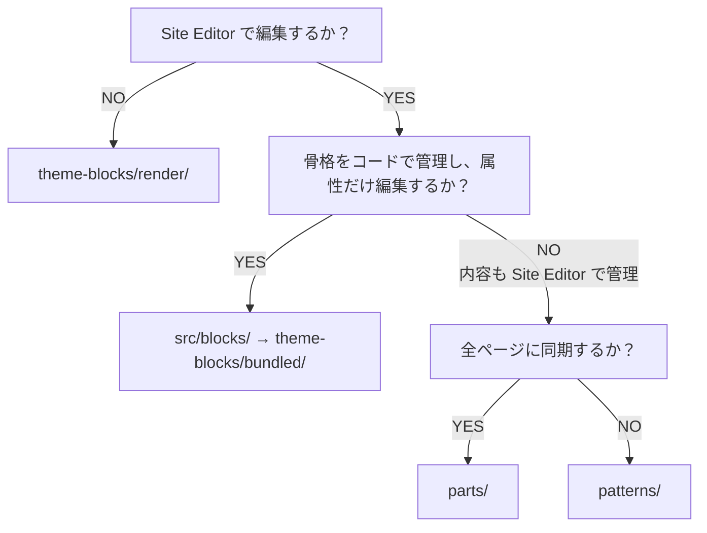

# WordPress Block Theme Starter

WordPress のブロックテーマ向けスターターです。FSE（フルサイト編集）の標準ディレクトリと、表示をファイルで管理するダイナミックブロックの配置方針をまとめています。

クラシックテーマを作成する場合は `wordpress-theme-starter` を使用してください。コピー手順は [SKILL.md](./SKILL.md) を参照してください。

---

## 1. ディレクトリ構成

```text
my-theme/
├── templates/                 # WordPress 標準。直下に配置する
│   ├── index.html             # 必須のフォールバック
│   ├── front-page.html
│   ├── home.html
│   ├── page.html
│   ├── single.html
│   ├── single-{cpt}.html      # CPT はファイル名で指定
│   ├── archive.html
│   ├── archive-{cpt}.html
│   ├── category.html
│   ├── taxonomy-{tax}.html
│   └── 404.html
├── parts/                     # WordPress 標準。直下に配置する
│   ├── header.html
│   ├── footer.html
│   └── cta.html               # 全ページ共通枠の例
├── patterns/                  # WordPress 6.8 以降はサブフォルダを使用できる
│   ├── header/
│   ├── footer/
│   ├── front/
│   └── card/
├── theme-blocks/
│   ├── editor.js              # render/ の SSR プレビュー。ビルド対象外
│   ├── render/                # block.json + render.php。ビルド対象外。2 層まで可
│   │   └── {group?}/{name}/
│   └── bundled/               # wp-scripts の出力先。ここだけ削除して再生成できる
├── src/
│   ├── frontend/              # Vite（サイト全体の JS / SCSS）
│   └── blocks/                # 編集可能な自作ブロックのソース
├── assets/                    # enqueue する CSS / JS / 画像
├── inc/                       # CPT・登録・ユーティリティ（ブロック本体は置かない）
├── theme.json
├── functions.php
├── style.css
├── package.json
└── vite.config.mjs
```

---

## 2. WordPress 標準フォルダの制約

| フォルダ | サブフォルダ | ルール |
| ---------- | -------------- | -------- |
| `templates/` | **不可** | 階層はファイル名で表現する |
| `parts/` | **不可** | パーツのスラッグはファイル名そのもの。`/` を含められない |
| `patterns/` | **WordPress 6.8 以降で可** | サブフォルダを用途別に分けられる（`header/`、`footer/` など） |

WordPress 6.8 以降では、`patterns/` 内の PHP ファイルがサブフォルダも含めて再帰的に読み込まれます。2 階層目以降も使用できますが、中規模までのテーマでは、まず `patterns/` 直下に用途別のフォルダを作る構成が分かりやすく、管理もしやすくなります。

```text
patterns/
├── header/                    # ヘッダーのデザイン候補
│   └── header-default.php
├── footer/                    # フッターのデザイン候補
│   └── footer-default.php
├── front/                     # フロントページ用のセクション
│   └── front-hero.php
└── card/                      # 再利用するカード系パターン
    ├── card-news.php
    └── card-related.php
```

`patterns/` 内のファイル名にも、分類フォルダに対応するプレフィックスを付けます。たとえば `header/` には `header-default.php`、`front/` には `front-hero.php` のように命名すると、ファイル単体で見た場合にも用途を判断できます。

パターンの種類が増え、直下のフォルダだけでは整理しにくくなった場合は、再利用部品を `components/` にまとめる構成へ拡張できます。

分類軸を混在させる場合は、各フォルダが「表示箇所」「部品の種類」「ページ単位」のどれを表すのかを、プロジェクトの README などに明記してください。

### ファイル名のプレフィックスを使う

`templates/` と `parts/` はサブフォルダを作れないため、ファイル名のプレフィックスで種類を区別します。

| 用途 | ファイル名の例 |
| -------------- | ---------------- |
| CPT のアーカイブ | `archive-library.html` |
| CPT の単体 | `single-news.html` |
| タクソノミー | `taxonomy-library_category.html` |
| 共通パーツ（1 種類） | `header.html` `footer.html` `cta.html` |
| 共通パーツを複数バージョン | `footer.html` `footer-centered.html` `footer-minimal.html` |

同じフッターを**別スラッグのパーツとして登録する**場合は、`footer-` プレフィックスを付けて `parts/` 直下に配置します。

同じ Footer エリアのデザインを Site Editor で切り替える場合は、`parts/` を増やさず、`patterns/` と `Block Types: core/template-part/footer` を組み合わせます（「6. パターンの登録とインサーター」を参照してください）。

`parts/*.html` には共通枠の詳細を直接記述せず、theme block や pattern の参照だけを記述します。基本構成は 1 行のブロック参照です。

```html
<!-- wp:my-theme/header /-->
<!-- wp:pattern {"slug":"my-theme/footer"} /-->
```

### Site Editor に表示されるテンプレートパーツ名

Site Editor の「パターン」>「テンプレートパーツ」に表示される名称は、`parts/*.html` のファイル名ではなく、`theme.json` の `templateParts` で設定します。`name` には拡張子を除いたファイル名、`title` には管理画面に表示する名称、`area` には所属する領域を指定します。

```json
{
  "templateParts": [
    {
      "name": "cta",
      "title": "共通 CTA",
      "area": "uncategorized"
    }
  ]
}
```

たとえば `parts/cta.html` の表示名を「共通 CTA」にする場合は、`name` を `cta` として登録します。表示名を翻訳可能にする場合は、テーマのテキストドメインに対応した翻訳文字列として `title` を定義してください。

### Site Editor に表示されるテンプレート名

テーマ独自のテンプレートを Site Editor や固定ページのテンプレート選択画面に表示する場合は、`theme.json` の `customTemplates` で表示名を設定します。`name` は `templates/` 内のファイル名から拡張子を除いた値、`title` は管理画面に表示する名称です。

たとえば `templates/company.html` を「会社情報」として登録する場合は、`theme.json` に次の定義を追加します。

```json
{
  "customTemplates": [
    {
      "name": "company",
      "title": "会社情報",
      "postTypes": ["page"]
    }
  ]
}
```

`index.html`、`front-page.html`、`single.html` など、WordPress が標準で認識するテンプレートの表示名は、`customTemplates` では変更できません。独自の表示名を付ける場合は、`company.html` のような独自ファイル名でテンプレートを作成し、`customTemplates` に登録します。

---

## 3. 置き場所と役割

| 置き場所 | 役割 |
| ---------- | ------ |
| `templates/` | ページ種別の骨格を初期配置する |
| `parts/` | Site Editor で編集し、参照元に同期する共通枠 |
| `patterns/` | ひな型やデザイン候補を提供する。展開後はコピーとなり、他の箇所とは同期されない |
| `theme-blocks/render/` | 表示全体をファイルで管理する PHP ダイナミックブロック |
| `src/blocks/` → `theme-blocks/bundled/` | 属性は管理画面、骨格はファイルで管理する自作ブロック |
| `src/frontend/` → `assets/` | サイト全体の CSS / JS |
| `inc/` | CPT・登録・ユーティリティ（ブロック本体は置かない） |

---

## 4. `parts/` と `patterns/` の同期の違い

| 種類 | 管理画面で編集したとき |
| --- | --- |
| **`parts/`（テンプレートパーツ）** | **同期される**。1 箇所の編集が、そのパーツを参照するすべてのテンプレートに反映される |
| **`patterns/`（通常パターン）** | **同期されない**。挿入時に内容がコピーされ、挿入先での編集は他の箇所に反映されない |

テーマの `patterns/` に置いたファイルだけでは同期パターン（Synced Pattern）は作成できません。全ページで一括編集する共通枠には `parts/` を使用します。

---

## 5. 配置の判断フロー



### `render/` と `bundled/` の使い分け

| | `theme-blocks/render/` | `src/blocks/` → `bundled/` |
| --- | ------------------------ | ---------------------------- |
| 適した用途 | パンくず、一覧ループ、条件分岐など、コードで完結する表示 | スライドの文言・画像など、運用担当者が編集する自作ブロック |
| 編集 UI | 原則なし（SSR プレビューのみ） | Inspector、InnerBlocks など |
| **正となる場所** | **すべてファイル**。`render.php` の変更が表示に反映される | **編集可能な属性は管理画面（ブロック保存）**。HTML の骨格はファイルで管理する |
| ビルド | 不要 | `wp-scripts` が必要 |

`bundled/` では、編集内容によって管理場所が分かれます。

- 管理者が編集した属性や InnerBlocks は、**投稿・テンプレート内のブロックデータ（DB）が正**です。
- **`render.php` を使用するダイナミックブロック**では、HTML 構造・クラス・クエリなどをファイルで管理します。
- **JavaScript のみで保存するブロック**では、ブロック定義を `edit.js` と `save.js` で管理します。ただし、保存済みインスタンスの HTML は DB に保存されるため、定義を変更しても自動更新されません。

| 管理したい内容 | 配置先 |
| ------ | ---------- |
| ページ種別の骨格 | `templates/` |
| Site Editor で編集しない表示（表示全体をファイルで管理） | `theme-blocks/render/` |
| 属性を運用で編集し、骨格をファイルで管理する表示 | `src/blocks/` → `theme-blocks/bundled/` |
| Site Editor で管理し、全ページに同期する共通枠 | `parts/` |
| Site Editor で管理し、同期する必要のないひな型 | `patterns/` |
| コアブロックで実現できる動的表示（例: Navigation） | コアブロックを使用する |

---

## 6. パターンの登録とインサーターへの表示

- ファイル先頭の docblock（`Title`、`Slug`、`Categories`）で自動登録されます
- デフォルトではインサーターに表示されます
- `Inserter: no` を指定するとパターン一覧に表示されません。コードで管理するセクションに適しています
- 新しいパターンが表示されない場合はテーマキャッシュを確認してください。必要に応じて `wp_clean_themes_cache()` を実行するか、`style.css` の `Version` を更新します

### ヘッダー／フッターのデザイン差し替え

Site Editor でヘッダーやフッターのデザインを選択できるようにするには、パターンに次の定義を追加します。

```text
 * Categories: footer
 * Block Types: core/template-part/footer
```

ヘッダーの場合は `core/template-part/header` を指定します。

`parts/footer.html` には初期デザインを指定します。同じ `Block Types` を持つパターンを複数登録すると、フッターのテンプレートパーツの候補として切り替えられます。

---

## 7. `theme-blocks/`

| パス | 役割 | ビルド |
| ------ | ------ | -------- |
| `theme-blocks/editor.js` | `render/` を Site Editor で ServerSideRender によりプレビュー表示する | ビルドしない。削除しない |
| `theme-blocks/render/{name}/` または `{group}/{name}/` | `block.json` + `render.php` | ビルドしない |
| `theme-blocks/bundled/` | 自作ブロックのビルド成果物 | `wp-scripts` でビルドする。削除して再生成できる |
| `src/blocks/` | 編集可能な自作ブロックのソース | WordPress は直接登録しない |

`render/` の最小構成:

```text
theme-blocks/render/archive-loop/
├── block.json     # "render": "file:./render.php"
└── render.php
```

`render/` は、サイト管理者が編集する必要のないブロックを機能別に整理するため、サブフォルダを 2 層まで使用できます。
これは WordPress の制限ではなく、このスターターで定める運用上のルールです。
対象となるブロックは増えやすいため、フォルダで分類して見通しを確保しつつ、階層が深くなりすぎないように 2 層を上限とします。

```text
theme-blocks/render/archive/archive-loop/
├── block.json
└── render.php
```

ブロック名は手書きの一覧ではなく、ディレクトリを走査して登録します（`inc/Blocks/Blocks.php`）。`render/` は深さ 2、`bundled/` は深さ 1 まで走査します。

### `render/` と `bundled/` を分ける理由

`templates/`、`parts/`、展開済みの `patterns` は、Site Editor で保存すると **DB が正**になります。ファイルを変更しても保存済みの内容が優先されるため、Site Editor 上の保存内容をリセットするまで表示に反映されません。

- コードだけで管理する表示 → `render/`（表示全体をファイルで管理）
- 運用担当者が編集する属性を持つ表示 → `bundled/`（属性は DB、構造はファイルで管理）

---

## 8. ビルドの対応関係

| 入力 | 出力 |
| ------ | ------ |
| `src/frontend/`（Vite） | `assets/css/` `assets/js/` |
| `src/blocks/`（wp-scripts） | `theme-blocks/bundled/` |

`render/` と `theme-blocks/editor.js` はビルドしません。削除して再生成できるのは `theme-blocks/bundled/` だけです。

---

## 9. 避ける構成

- `templates/` / `parts/` にサブフォルダを切る
- ブロック成果物をテーマ直下の `blocks/` に置く。ブロック関連の成果物は `theme-blocks/` に配置する
- ファイルだけで変更したい表示を、`patterns/` や `templates/` に直接記述しすぎる（Site Editor で保存した内容が優先され、ファイル変更が反映されないため）
- `theme-blocks/editor.js` を削除する

---

## 10. テンプレートの構成例

```text
templates/archive-{cpt}.html
  └─ parts/header.html         ← 同期される共通枠
  └─ theme-blocks/render/...   ← ファイル変更が表示に反映される
  └─ parts/cta.html            ← 運用で編集する共通パーツ
  └─ parts/footer.html         ← 初期デザイン。差し替え候補は patterns/
```
